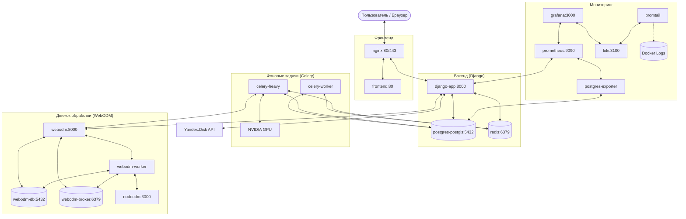

# Архитектура контейнеров и схема взаимодействия

В проекте используется микросервисная архитектура, развернутая с помощью Docker Compose. Все контейнеры объединены в общую сеть `photogrametrista_net`.

## Схема взаимодействия

## Описание компонентов

### 1. Точка входа (Edge)
*   **Nginx**: Реверс-прокси. Распределяет трафик между фронтендом (статические файлы) и бэкендом (API). Также обслуживает медиа-файлы и статику.

### 2. Прикладной уровень
*   **Frontend**: React-приложение, скомпилированное и обслуживаемое через Nginx или внутренний сервер (в зависимости от режима).
*   **Django-app**: Основная логика API, аутентификация, управление проектами.

### 3. Базы данных и кэш
*   **PostgreSQL (PostGIS)**: Основное хранилище геоданных и метаданных.
*   **Redis**: Брокер сообщений для Celery и кэширование.

### 4. Распределенные вычисления
*   **Celery Worker**: Легкие задачи (импорт из облака, генерация отчетов, уведомления).
*   **Celery Heavy**: Ресурсоемкие задачи (запуск фотограмметрии, GIS-анализ). Имеет доступ к GPU для ускорения вычислений.

### 5. Интеграция с WebODM
*   **WebODM / NodeODM**: Изолированный стек для профессиональной сшивки снимков. Бэкенд Django общается с ним через API (Client-Server).

### 6. Мониторинг (Observability)
*   **Prometheus**: Сбор метрик с Django, БД и системных экспортеров.
*   **Grafana**: Визуализация метрик на дашбордах.
*   **Loki / Promtail**: Сбор и централизованное хранение логов всех контейнеров.
